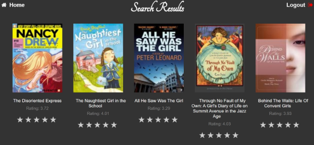
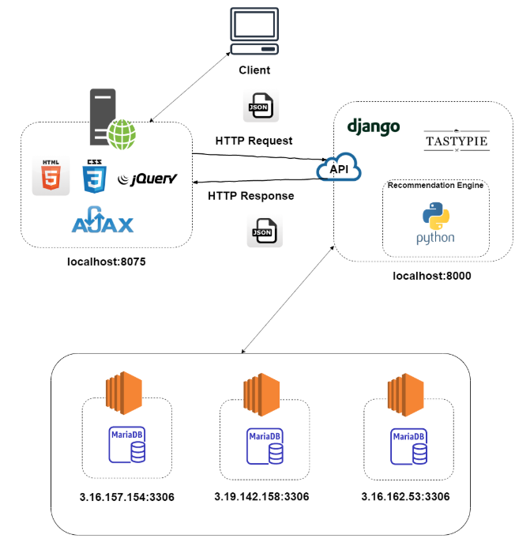

# BookRecommendationSystem

# Motivation
Book recommendation system aims to provide recommendations to a user based on
item-based collaborative filtering (personalized recommendations) as well as “New
Releases” and “Popular Books” which will be typically non-personalized
recommendations. Such a powerful recommendation system would enhance the user
experience and eventually increase revenue. It focuses on enhancing the customer
experience with personalized offers.

# Demo
Check the project demo at https://youtu.be/pbyd2SVwlis

# Tools & Technologies Used
● HTML5

● CSS3

● jQuery

● AJAX

● Django 2.1.12

● Tastypie RESTful API framework

● AWS - Galera cluster: MariaDB

● Python

● Visual Studio IDE

● Postman

● HeidiSQL

# Screenshots

# Architecture

# Features
- Allow the user to register and login
- Capture user_id as cookie after login to provide a personalized recommendation
- Provide suggestions to the user based on book genre using AJAX call to Tastypie RESTful API - in the sections Children, Comic, History, Mystery, Poetry, Romance and Adult on the Home page
- Recommend a list of books based on “New Releases” using AJAX call to Tastypie RESTful API - in the ‘New Releases’ section
- Provide “Popular Books” using AJAX call to Tastypie RESTful API - in the ‘Popular Books’ section
- Suggest interesting reads based on item-based collaborative filtering making AJAX call to recommendation engine exposed as an API endpoint - in the ‘You May Also Like section
- Allow user to search books based on the title using AJAX call to Tastypie RESTful API

# Dataset
- Dataset was collected from https://sites.google.com/eng.ucsd.edu/ucsdbookgraph/home. 
- Categories selected were Children, Comics, Adult, Romance, History, Mystery, and Poetry.

# Recommendation Engine
The recommendation engine works based on a technique called item-based collaborative filtering. The motivation of using item-based collaborative filtering is that people with similar likings might want read similar types of books. For eg. user P might have liked and rated books B1, B2, B3 and user Q might have liked and rated books B1, B2, B4, then there is a chance that P might like B4 and Q might like B3. 
The logic used to implement the idea is as follows:
- Due to computational issues, reduced the data set by considering the books that were rated at least 200 times and book that had an average rating of 4.5 or more. 
- As we have user, item based collaborative filtering, to provide recommendations to a user, user should have rated at least two books.
Utilized the columns book_id, avg_rating and ratings_count fields from the books table and book_id, user_id, rating fields from the book_reviews table.
- Create a ratings_matrix by creating a pivot of user_id, book_id with values as ratings to understand which user has rated which book and what is the rating.
- Then, found the similarity among the users based on the books they have rated using the cosine_simiarity() function. This helped understand which users are similar to each other. Stored these values in a data frame.
- Used the above data frame to find the 10 most similar users to the user who has logged in.
- Created a list of all the books read by the 10 similar users minus the books read by the logged in user. This helped find the potential books that could be recommended to the logged in user.
- Based on the ratings in descending order of the ratings, recommended 5-10 books to the logged in user

